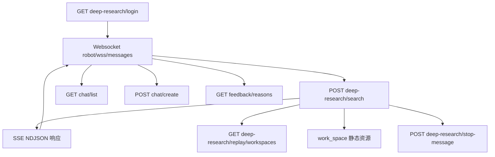

# API 接口文档

## 通用约定

- **Base URL**：`/api/nae-deep-research/v1`（配置项 `custom_config["base_api_url"]`，定义于 `cosight_server/deep_research/common/config.py`）。
- **Chatbot Base URL**：`/api/openans-support-chatbot/v1`（配置项 `custom_config["base_chatbot_api_url"]`）。
- **返回格式**：除流式接口外，REST API 统一使用 `json_result` 结构。

  ```json
  {
    "code": 0,
    "msg": "success",
    "data": {...}
  }
  ```

  实现参考 `cosight_server/sdk/common/api_result.py`。
- **认证**：Demo 默认依赖 Cookie（`session_manager.login` 写入），若前端未提供 Cookie，可按需扩展。

## 1. 身份与聊天管理

### 1.1 GET `/deep-research/login`

- **模块**：`cosight_server/deep_research/routers/user_manager.py`
- **描述**：创建或刷新会话，写入 Cookie。
- **请求头**：`cookie`（可选，沿用旧会话）、`Referer`。
- **响应**：`session_manager.login` 返回的结构，包含 `Set-Cookie`。

### 1.2 POST `/deep-research/logout`

- **模块**：同上
- **描述**：退出登录，清空缓存。
- **请求头**：`cookie`（可选）
- **响应**：`session_manager.logout` 结果。

### 1.3 GET `/chat/list`

- **模块**：`cosight_server/deep_research/routers/chat_manager.py`
- **描述**：返回客户端聊天会话列表（当前固定为空数组）。
- **请求头**：`client_id`（可选）
- **响应**：`{"code":0,"msg":"get chat list success","data":[]}`。

### 1.4 POST `/chat/create`

- **模块**：`chat_manager.py`
- **描述**：创建聊天会话，服务端会重置 `participants`、`showName` 等字段。
- **请求头**：`client_id`、`cookie`（均可选）
- **请求体**：`Chat` 对象（定义于 `cosight_server/sdk/entities/chat.py`）。
- **响应**：返回调整后的 `Chat` 实体。

### 1.5 POST `/chat/edit`

- **模块**：`chat_manager.py`
- **描述**：编辑聊天属性，当前直接回显输入。

## 2. 调研任务接口

### 2.1 POST `/deep-research/search`

- **模块**：`cosight_server/deep_research/routers/search.py`
- **用途**：发起或复用调研任务。该接口通过 `StreamingResponse` 输出 NDJSON 字节流，每行一个 JSON。
- **请求体**（关键字段）：

  ```json
  {
    "content": [{"type": "text", "value": "任务描述"}],
    "sessionInfo": {
      "sessionId": "topic-uuid",
      "messageSerialNumber": "plan_xxx",
      "locale": "zh-CN",
      "username": "user"
    },
    "stream": true,
    "replay": false,
    "replayWorkspace": "work_space/work_space_20250101_000000_000000"
  }
  ```

- **响应**：按行返回不同类型：
  - `contentType: "lui-message-manus-step"`：计划快照（含 `title`、`steps`、`progress`、`statusText` 等）。
  - `contentType: "lui-message-tool-event"`：工具事件（`event_type`、`tool_name`、`processed_result`、`step_index` 等）。
  - `contentType: "lui-message-credibility-analysis"`：可信信息。
- **实现要点**：`RecordGenerator` 负责落盘 `replay.json`、在回放模式下输出历史记录；`append_create_plan_local` 写 `plans/{plan_id}.log`。

### 2.2 GET `/deep-research/search-results`

- **模块**：`search.py`
- **描述**：生成可嵌入的静态 HTML，用于展示搜索结果链接。`ToolResultProcessor` 在 search 工具不可嵌入时会回退到该页面。
- **查询参数**：`query`（URL 编码）、`tool`（可选）、`timestamp`（可选）。

### 2.3 GET `/deep-research/replay/workspaces`

- **模块**：`search.py`
- **描述**：列出包含 `replay.json` 的工作区。返回字段：`workspace_name`、`workspace_path`、`title`、`created_time`、`message_count`、`replay_file`。

### 2.4 GET `/deep-research/server-timestamp`

- **模块**：`cosight_server/deep_research/routers/common.py`
- **描述**：返回服务启动毫秒级时间戳（`server_start_timestamp`），用于前端健康检查。

### 2.5 POST `/deep-research/stop-message`

- **模块**：`common.py`
- **描述**：在缓存中标记某个 `messageId` 已被终止（设置 `Cache.put("is_message_stopped_{messageId}", True)`）。
- **请求体**：`{"messageId": "<plan-id>"}`。

## 3. 反馈接口

### 3.1 GET `/feedback/reasons`

- **模块**：`cosight_server/deep_research/routers/feedback.py`
- **描述**：返回可用的反馈原因列表（当前返回空列表）。支持 `lang` 查询参数。

## 4. WebSocket

### 4.1 `GET /robot/wss/messages`

- **模块**：`cosight_server/deep_research/routers/websocket_manager.py`
- **协议**：标准 WebSocket（FastAPI `APIRouter.websocket`）。
- **查询参数**：`websocket-client-key`（用于区分客户端，可选）、`lang`（必填，用于国际化）。
- **握手**：连接成功后立即发送 `type: welcome` 消息，包含欢迎提示。
- **消息格式**：
  - **订阅**：`{"action":"subscribe","topic":"plan_xxx"}`，服务端会把 topic 映射到当前连接，供重连使用。
  - **任务消息**：`{"action":"message","topic":"plan_xxx","data":"{...json...}"}`，`data` 中包含 `initData`（LLM 输入）、`roleInfo`、`mentions` 等。服务端会：
    1. 通过 `_send_resp` 将消息转发给 `/deep-research/search`（HTTP POST）。
    2. 将来自 SSE 的响应逐条转发到同一 topic。
  - **服务端推送**：`manager.send_json_to_topic` 按 `lui-message-*`、`control-status-message` 等类型发送，字段与 SSE 内容一致。

## 5. 静态资源

- **上传目录**：`/api/nae-deep-research/v1/upload_files/**`（根目录由 `TRAFFIC_OPS_UPLOAD_DIR` 控制）。
- **工作区目录**：`/api/nae-deep-research/v1/work_space/**`，直接映射到后端 `work_space` 子目录。
- **前端页面**：`/cosight/**`（`web` 目录下静态资源）。

## 6. 状态码与错误

- **成功**：`code = 0`。
- **失败**：`global_exception_handler` 捕获未处理异常并返回 `HTTP 500`，响应体如下：

  ```json
  {
    "message": "An unexpected error occurred.",
    "details": "原始异常信息"
  }
  ```

- **调研流断开**：WebSocket 端若检测到 SSE 中 plan 已完成，会额外发送 `{"type": "control-status-message", "initData": {"status": "finished_successfully"}}`，客户端可据此更新 UI。

## 7. 接口调用关系



- **登录链路**：前端首先调用 `/deep-research/login` 取得 Cookie，随后建立 WebSocket 连接。
- **任务链路**：WebSocket `message` 请求映射到 `POST /deep-research/search`，该接口写回 `work_space` 文件、`plans/*.log`，并通过 SSE 将结果推回 WebSocket。
- **回放链路**：需要列举历史任务时，客户端调用 `/deep-research/replay/workspaces` 获取所有工作区，再以 `replayWorkspace` 参数复用 `POST /deep-research/search` 进行回放。
- **静态文件**：当工具生成文件或 `ToolResultProcessor` 输出路径时，前端直接访问 `work_space` 静态路由获取。
- **控制链路**：`/deep-research/stop-message` 可终止长任务；`/feedback/reasons`、`/chat/*` 提供辅助能力。
