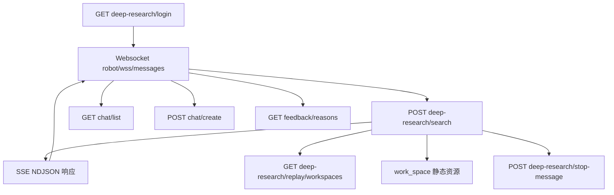

# API 接口文档

## 通用约定

- **Base URL**：`/api/nae-deep-research/v1`（配置项 `custom_config["base_api_url"]`，定义于 `cosight_server/deep_research/common/config.py`）。
- **Chatbot Base URL**：`/api/openans-support-chatbot/v1`（配置项 `custom_config["base_chatbot_api_url"]`）。
- **返回格式**：除流式接口外，REST API 统一使用 `json_result` 结构。

  ```json
  {
    "code": 0,
    "msg": "success",
    "data": {...}
  }
  ```

  实现参考 `cosight_server/sdk/common/api_result.py`。
- **认证**：Demo 默认依赖 Cookie（`session_manager.login` 写入），若前端未提供 Cookie，可按需扩展。

## 1. 身份与聊天管理

### 1.1 GET `/deep-research/login`

- **模块**：`cosight_server/deep_research/routers/user_manager.py`
- **描述**：创建或刷新会话，写入 Cookie。
- **请求头**：`cookie`（可选，沿用旧会话）、`Referer`。
- **响应**：`session_manager.login` 返回的结构，包含 `Set-Cookie`。

### 1.2 POST `/deep-research/logout`

- **模块**：同上
- **描述**：退出登录，清空缓存。
- **请求头**：`cookie`（可选）
- **响应**：`session_manager.logout` 结果。

### 1.3 GET `/chat/list`

- **模块**：`cosight_server/deep_research/routers/chat_manager.py`
- **描述**：返回客户端聊天会话列表（当前固定为空数组）。
- **请求头**：`client_id`（可选）
- **响应**：`{"code":0,"msg":"get chat list success","data":[]}`。

### 1.4 POST `/chat/create`

- **模块**：`chat_manager.py`
- **描述**：创建聊天会话，服务端会重置 `participants`、`showName` 等字段。
- **请求头**：`client_id`、`cookie`（均可选）
- **请求体**：`Chat` 对象（定义于 `cosight_server/sdk/entities/chat.py`）。
- **响应**：返回调整后的 `Chat` 实体。

### 1.5 POST `/chat/edit`

- **模块**：`chat_manager.py`
- **描述**：编辑聊天属性，当前直接回显输入。

## 2. 调研任务接口

### 2.1 POST `/deep-research/search`

- **模块**：`cosight_server/deep_research/routers/search.py`
- **用途**：发起或复用调研任务。该接口通过 `StreamingResponse` 输出 NDJSON 字节流，每行一个 JSON。
- **请求体**（关键字段）：

  ```json
  {
    "content": [{"type": "text", "value": "任务描述"}],
    "sessionInfo": {
      "sessionId": "topic-uuid",
      "messageSerialNumber": "plan_xxx",
      "locale": "zh-CN",
      "username": "user"
    },
    "stream": true,
    "replay": false,
    "replayWorkspace": "work_space/work_space_20250101_000000_000000"
  }
  ```

- **响应**：按行返回不同类型：
  - `contentType: "lui-message-manus-step"`：计划快照（含 `title`、`steps`、`progress`、`statusText` 等）。
  - `contentType: "lui-message-tool-event"`：工具事件（`event_type`、`tool_name`、`processed_result`、`step_index` 等）。
  - `contentType: "lui-message-credibility-analysis"`：可信信息。
- **实现要点**：`RecordGenerator` 负责落盘 `replay.json`、在回放模式下输出历史记录；`append_create_plan_local` 写 `plans/{plan_id}.log`。

### 2.2 GET `/deep-research/search-results`

- **模块**：`search.py`
- **描述**：生成可嵌入的静态 HTML，用于展示搜索结果链接。`ToolResultProcessor` 在 search 工具不可嵌入时会回退到该页面。
- **查询参数**：`query`（URL 编码）、`tool`（可选）、`timestamp`（可选）。

### 2.3 GET `/deep-research/replay/workspaces`

- **模块**：`search.py`
- **描述**：列出包含 `replay.json` 的工作区。返回字段：`workspace_name`、`workspace_path`、`title`、`created_time`、`message_count`、`replay_file`。

### 2.4 GET `/deep-research/server-timestamp`

- **模块**：`cosight_server/deep_research/routers/common.py`
- **描述**：返回服务启动毫秒级时间戳（`server_start_timestamp`），用于前端健康检查。

### 2.5 POST `/deep-research/stop-message`

- **模块**：`common.py`
- **描述**：在缓存中标记某个 `messageId` 已被终止（设置 `Cache.put("is_message_stopped_{messageId}", True)`）。
- **请求体**：`{"messageId": "<plan-id>"}`。

## 3. 反馈接口

### 3.1 GET `/feedback/reasons`

- **模块**：`cosight_server/deep_research/routers/feedback.py`
- **描述**：返回可用的反馈原因列表（当前返回空列表）。支持 `lang` 查询参数。

## 4. WebSocket

### 4.1 `GET /robot/wss/messages`

- **模块**：`cosight_server/deep_research/routers/websocket_manager.py`
- **协议**：标准 WebSocket（FastAPI `APIRouter.websocket`）。
- **查询参数**：`websocket-client-key`（用于区分客户端，可选）、`lang`（必填，用于国际化）。
- **握手**：连接成功后立即发送 `type: welcome` 消息，包含欢迎提示。
- **消息格式**：
  - **订阅**：`{"action":"subscribe","topic":"plan_xxx"}`，服务端会把 topic 映射到当前连接，供重连使用。
  - **任务消息**：`{"action":"message","topic":"plan_xxx","data":"{...json...}"}`，`data` 中包含 `initData`（LLM 输入）、`roleInfo`、`mentions` 等。服务端会：
    1. 通过 `_send_resp` 将消息转发给 `/deep-research/search`（HTTP POST）。
    2. 将来自 SSE 的响应逐条转发到同一 topic。
  - **服务端推送**：`manager.send_json_to_topic` 按 `lui-message-*`、`control-status-message` 等类型发送，字段与 SSE 内容一致。

## 5. 静态资源

- **上传目录**：`/api/nae-deep-research/v1/upload_files/**`（根目录由 `TRAFFIC_OPS_UPLOAD_DIR` 控制）。
- **工作区目录**：`/api/nae-deep-research/v1/work_space/**`，直接映射到后端 `work_space` 子目录。
- **前端页面**：`/cosight/**`（`web` 目录下静态资源）。

## 6. 状态码与错误

- **成功**：`code = 0`。
- **失败**：`global_exception_handler` 捕获未处理异常并返回 `HTTP 500`，响应体如下：

  ```json
  {
    "message": "An unexpected error occurred.",
    "details": "原始异常信息"
  }
  ```
- **调研流断开**：WebSocket 端若检测到 SSE 中 plan 已完成，会额外发送 `{"type": "control-status-message", "initData": {"status": "finished_successfully"}}`，客户端可据此更新 UI。

### 6.1 配置缺失相关错误

- 当后端检测到缺少 LLM 关键配置（例如 `.env` 中未设置 `API_KEY`）时，当前设计不会阻止 FastAPI 启动，而是在真正调用调研接口时通过 Plan 结果或工具事件返回“配置缺失”的可读错误信息，同时在日志中记录详细告警，避免出现 `TypeError: str expected, not NoneType` 或浏览器 `ERR_EMPTY_RESPONSE` 这类启动阶段错误。**实现状态**：该行为通过本次修改在 `config/config.py` 与根目录 `llm.py`、`cosight_server/deep_research/routers/search.py` 中落地。

## 7. 接口调用关系



- **登录链路**：前端首先调用 `/deep-research/login` 取得 Cookie，随后建立 WebSocket 连接。
- **任务链路**：WebSocket `message` 请求映射到 `POST /deep-research/search`，该接口写回 `work_space` 文件、`plans/*.log`，并通过 SSE 将结果推回 WebSocket。
- **回放链路**：需要列举历史任务时，客户端调用 `/deep-research/replay/workspaces` 获取所有工作区，再以 `replayWorkspace` 参数复用 `POST /deep-research/search` 进行回放。
- **静态文件**：当工具生成文件或 `ToolResultProcessor` 输出路径时，前端直接访问 `work_space` 静态路由获取。
- **控制链路**：`/deep-research/stop-message` 可终止长任务；`/feedback/reasons`、`/chat/*` 提供辅助能力。

## 8. 外部模型与工具依赖

本节列出 Co-Sight 运行时依赖的“额外模型”和“外部工具/服务”，以及相关环境变量，方便在部署或调试时对齐配置。

### 8.1 LLM 模型配置（兼容 OpenAI API）

所有大模型均按“OpenAI 兼容 API”方式调用，由 `config/config.py` 提供配置函数，`llm.py` 统一初始化：

| 模型用途 | 配置函数 | 关键环境变量 | 说明 |
| --- | --- | --- | --- |
| 通用模型（默认） | `get_model_config` | `API_KEY`、`API_BASE_URL`、`MODEL_NAME`、`MAX_TOKENS`、`TEMPERATURE`、`PROXY` | 其它专用模型未配置时的回退；用于通用 Chat/Tool 场景。 |
| 规划模型（Planner） | `get_plan_model_config` | `PLAN_API_KEY`、`PLAN_API_BASE_URL`、`PLAN_MODEL_NAME`、`PLAN_MAX_TOKENS`、`PLAN_TEMPERATURE`、`PLAN_PROXY` | 专用于 `TaskPlannerAgent` 生成 DAG 计划；缺失时退回通用模型。 |
| 执行模型（Actor） | `get_act_model_config` | `ACT_API_KEY`、`ACT_API_BASE_URL`、`ACT_MODEL_NAME`、`ACT_MAX_TOKENS`、`ACT_TEMPERATURE`、`ACT_PROXY` | 专用于 `TaskActorAgent` 执行步骤和调用工具；缺失时退回通用模型。 |
| 工具辅助模型 | `get_tool_model_config` | `TOOL_API_KEY`、`TOOL_API_BASE_URL`、`TOOL_MODEL_NAME`、`TOOL_MAX_TOKENS`、`TOOL_TEMPERATURE`、`TOOL_PROXY` | 用于某些需要二次加工工具结果的场景（如深度搜索、可视化提示等）；缺失时退回通用模型。 |
| 多模态模型 | `get_vision_model_config` | `VISION_API_KEY`、`VISION_API_BASE_URL`、`VISION_MODEL_NAME`、`VISION_MAX_TOKENS`、`VISION_TEMPERATURE`、`VISION_PROXY` | 被 `VisionTool` / `VideoTool` / `AudioTool` 使用，支持图片/视频/音频问答等能力。 |
| 可信分析模型 | `get_credibility_model_config` | `CREDIBILITY_API_KEY`、`CREDIBILITY_API_BASE_URL`、`CREDIBILITY_MODEL_NAME`、`CREDIBILITY_MAX_TOKENS`、`CREDIBILITY_TEMPERATURE`、`CREDIBILITY_PROXY` | 被 `credibility_analyzer` 使用，用于对单步结果进行五类可信度分析；缺失时退回通用模型。 |
| 浏览器自动化模型 | `get_browser_model_config` | `BROWSER_API_KEY`、`BROWSER_API_BASE_URL`、`BROWSER_MODEL_NAME`、`BROWSER_MAX_TOKENS`、`BROWSER_TEMPERATURE`、`BROWSER_PROXY` | 预留给浏览器自动化场景（如“browser_use”类工具），当前编排中未默认启用。 |

> 注意：上述环境变量均在 `.env` 中配置；未配置的专用模型会自动退回到通用模型配置，因此系统在最低配置下只需提供 `API_KEY`、`API_BASE_URL` 与 `MODEL_NAME` 即可启动。

### 8.2 搜索与外部服务工具

调研任务中大量依赖搜索与外部 API，这些能力仅通过“工具调用”间接暴露给前端，不直接对外提供 HTTP 接口，但需要在部署时正确配置其密钥：

| 工具/服务 | 对应函数/类 | 必要环境变量/配置 | 说明 |
| --- | --- | --- | --- |
| Tavily 搜索 | `SearchToolkit.tavily_search`、`DeepSearchToolkit` | `TAVILY_API_KEY` | 使用 Tavily SDK 调用搜索 API，支持 general/news 等主题，详见 Tavily 官方文档。 |
| Google 自定义搜索 | `SearchToolkit.search_google`、`google_api_key.APIKEYS` | `GOOGLE_API_KEY`、`SEARCH_ENGINE_ID`，以及可选的 `google_api_key.json` 轮换配置 | 通过 Google Custom Search API 做网页检索，`google_api_key.py` 支持多 key 轮换与计数控制。 |
| Brave 搜索 | `SearchToolkit.search_brave` | `BRAVE_API_KEY` | 调用 Brave 官方 Web Search API，支持多种 result_filter 与新鲜度控制。 |
| Linkup 搜索 | `SearchToolkit.search_linkup` | `LINKUP_API_KEY` | 通过 Linkup SDK 调用结构化/有来源的搜索结果。 |
| Wolfram Alpha | `SearchToolkit.query_wolfram_alpha` | `WOLFRAMALPHA_APP_ID` | 用于数理计算/公式推导等场景，依赖 WolframAlpha 官方 API。 |
| DuckDuckGo 搜索 | `SearchToolkit.search_duckduckgo` | 无额外环境变量 | 使用 `duckduckgo_search` 库做无密钥搜索，注意受网络环境和封锁策略影响。 |
| Wikipedia | `SearchToolkit.search_wiki` | 无额外环境变量 | 通过 `wikipedia` 库读取百科摘要与页面 URL。 |
| Baidu 搜索 | `search_util.search_baidu` | 可选：`PROXY` | 使用 HTML 抓取方式访问百度搜索结果，并对重定向链接与摘要做解析。 |

这些工具在执行阶段由 `TaskActorAgent` 注册进 `BaseAgent.functions`，通过 LLM 的 tool call 自动选择并执行；结果经 `ToolResultProcessor` 标准化后，以 `lui-message-tool-event` 形式流向前端。

### 8.3 MCP Server 工具（外部技能）

Co-Sight 同时支持通过 MCP（Model Context Protocol）接入外部技能：

- **配置入口**：`config/mcp_server_config.json` 中声明 MCP Server 信息（名称、端点、可用函数等）。  
- **加载与调用**：  
  - `BaseAgent.get_mcp_tools` 在初始化时解析该配置，将 MCP 函数暴露给 LLM 作为工具；  
  - 当 LLM 触发的 `tool_calls` 不在本地 `functions` 字典中时，`_execute_mcp_tool_call` 会尝试通过 `MCPEngine.invoke_mcp_tool` 调用对应的 MCP Server。  
- **说明**：MCP 工具不会新增 HTTP API 路径，它们仅在内部作为“可扩展工具”存在，并通过 `tool_event` 流转到前端，供 UI 展示过程和结果。  

在部署新模型或外部工具前，建议先在 `.env` 和 `config/mcp_server_config.json` 中补齐相关配置，然后参考本节确认是否满足密钥与网络访问要求。
