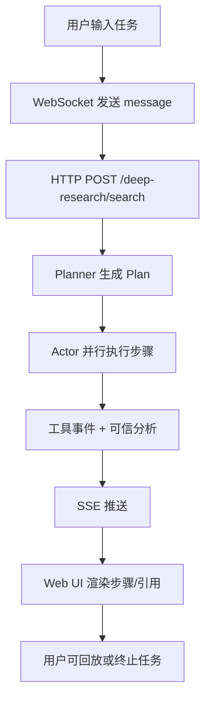

# 产品需求文档（PRD）

## 1. 概述

- **产品名称**：Co-Sight 智能调研引擎
- **版本**：v0.1（支撑当前开源实现）
- **作者**：Co-Sight 团队
- **状态**：Draft（结合当前代码的事实总结）

## 2. 背景

- 手工调研成本高、反馈慢；闭源工具费用昂贵且难以私有化。
- 需要可运行在企业内网的 Manus 风格产品，支持任务拆解、工具调用、报告产出。
- 需要结构化的可信信息呈现，避免“幻觉”。

## 3. 用户画像

| 角色 | 需求 | 关键痛点 |
| --- | --- | --- |
| 行研/战略分析师 | 快速产出行业、公司研究报告，追踪事件动态 | 手工搜索、整理资料耗时；难以保证引用可信 |
| 运营/自媒体 | 生成旅行攻略、热点资讯、深度解读 | 需要视觉化内容、链接素材 |
| IT 运维 | 希望系统易部署、可观察、易扩展 | 私有化环境限制，权限管控、日志留痕 |

## 4. 用户场景

1. **行业研究**：输入“帮我分析中兴通讯”，系统拆解为“财务表现/市场格局/风险”步骤，自动搜索、下载资料、生成 HTML/PDF 报告。
2. **热点追踪**：输入“特朗普关税政策影响”，系统持续抓取新闻、筛选权威来源，并产出可信分类列表。
3. **旅行攻略**：输入“上海 3 日游安排”，系统从多站点抓取博客/图片，生成图文报告。

## 5. 核心功能

| 功能 | 描述 | 用户价值 | 负责人 | 交付情况 |
| --- | --- | --- | --- | --- |
| DAG 规划 | 将任务拆解为步骤，并展示依赖/状态 | 用户可了解 AI 在做什么，也能中断/重放 | Planner/LLM | 已上线 |
| 多工具执行 | 支持搜索、网页抓取、文件处理、代码执行、多模态等 | 自动化资料收集、数据加工 | Actor/Toolkits | 已上线 |
| 实时事件 | WebSocket + SSE 推送每个步骤、工具结果、可信分析 | 用户实时感知进度，便于审阅/回滚 | Web 前端 | 已上线 |
| 可信分析 | 依据工具结果输出 5 类可信信息 | 辅助判断引用等级，减少幻觉 | Credibility Analyzer | 已上线 |
| 回放/存档 | 自动生成 `replay.json` 和 `plan.log`，可随时重播 | 方便复盘、分享、审计 | Search Router | 已上线 |
| Docker 运行 | 一键脚本 `run_cosight_docker.bat` 启动容器 | 降低部署门槛 | DevOps | 已上线 |

## 6. 体验流程

## 7. 功能需求详情

- **规划**
  - R1：支持多语言任务，默认根据输入语言选择 Prompt。
  - R2：当 `Plan` 为空时最多重试 3 次，每次将失败原因写入 Prompt。
  - R3：计划结果需落盘 `plans/{plan_id}.final.json`。
- **执行**
  - R4：允许并行执行，最多受限于 `ready_steps` 数量。
  - R5：每个工具调用都需记录时长、错误、processed_result。
  - R6：失败步骤标记为 `blocked`，错误内容写入 `step_notes`。
- **可信分析**
  - R7：保证每个 `completed` 步骤在首次完成时触发可信分析。
  - R8：提示词需提供工具结果摘要与 JSON 细节，输出结构化 JSON。
- **前端交互**
  - R9：`lui-message-manus-step` 替换全量 plan；`lui-message-tool-event` 与 `lui-message-credibility-analysis` 以 append 方式呈现。
  - R10：提供 `/deep-research/replay/workspaces` 列表供选择回放源。

## 8. 非功能需求

- **启动时间**：Docker 脚本在 2 分钟内完成依赖安装并启动服务。
- **资源占用**：默认 4C/4G；若工具大量并发，需扩容 LLM QPS。
- **日志**：所有异常需通过 `logger` 打印堆栈；`plan.log` 需可读。
- **可扩展性**：新增工具需只改 Toolkits 与 `TaskActorAgent` 注册，不影响核心。

## 9. 指标

- 任务成功率（未报错地返回 `plan_result`）≥ 95%（在可用外部 API 情况下）。
- 工具事件延迟：从工具完成到前端展示 < 3s。
- 可信分析完成率：≥ 90% 步骤有可信信息。
- Docker 启动成功率：100%。

## 10. 发布计划

| 阶段 | 内容 | Owner | 时间 |
| --- | --- | --- | --- |
| Alpha | 支持本地部署+Web UI | 开源社区 | 已完成 |
| Beta | 完善回放、可信分析 | 开源社区 | 已完成 |
| GA | 增强 re-plan 能力、权限控制 | TODO | 待排期 |

## 11. 风险与缓解

- **LLM 不稳定**：通过重试、JSON 修复与参数映射降低风险，但仍需人工监督。
- **外部依赖失败**：`ToolResultProcessor` 显示失败原因，用户可手动重跑。
- **re-plan 未自动化**：第 9 节“计划修正与容错”描述了扩展点，未来应在 `CoSight.execute` 检查 `Plan.has_blocked_steps()` 并触发 `re_plan`。

## 12. 附录

- 相关文档：`docs/features.md`、`docs/system_architecture.md`、`docs/high_level_design.md`、`docs/detailed_design.md`、`docs/api_reference.md`、`docs/requirements.md`
- 运行脚本：`run_cosight_docker.bat`

