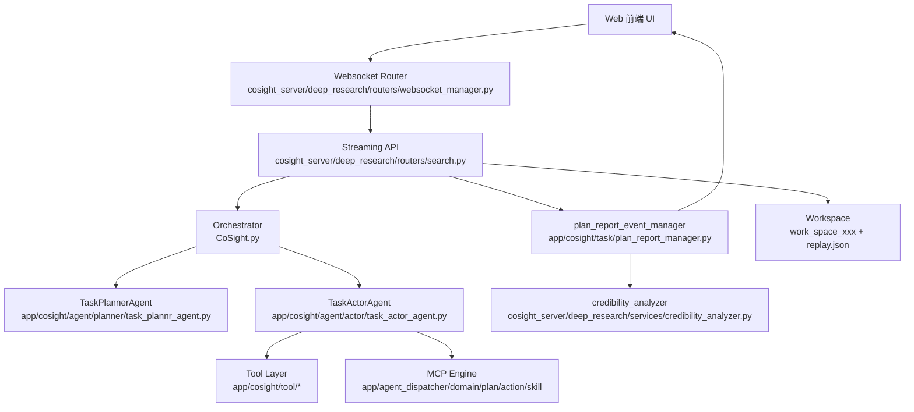
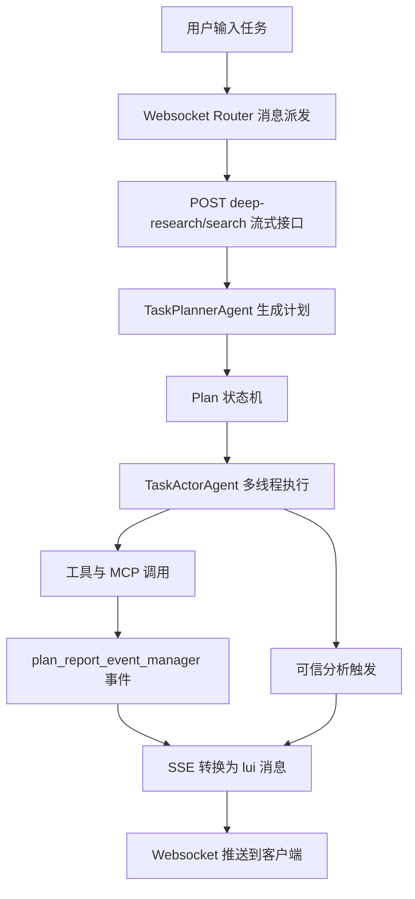
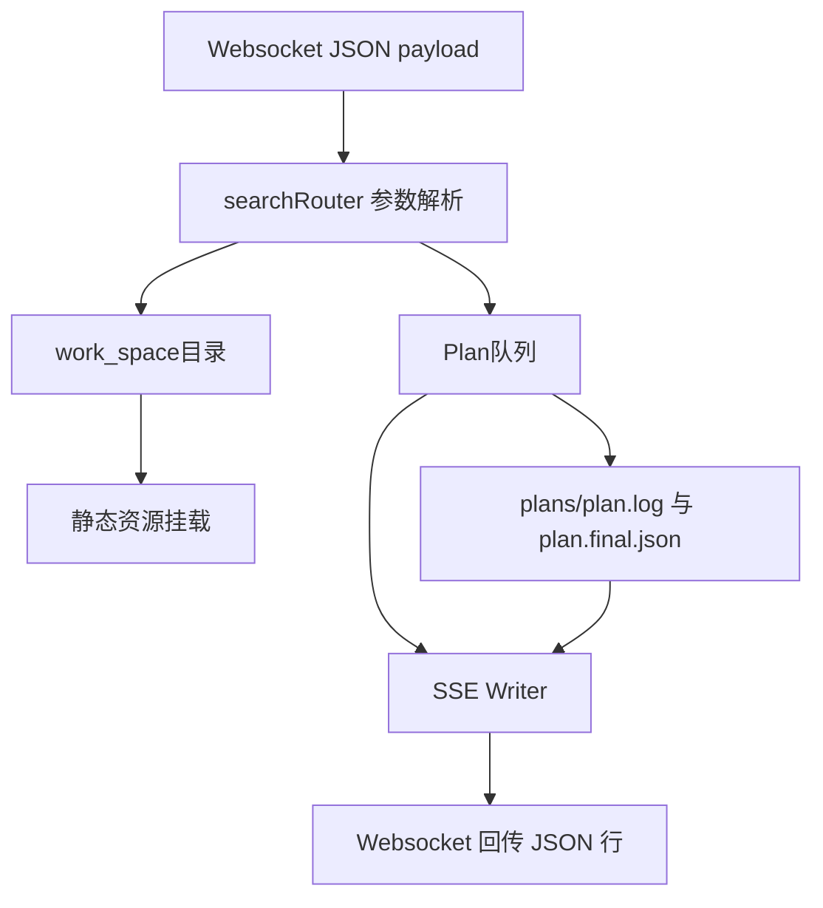

# 系统架构设计

## 设计目标

- **解耦前后端**：通过 WebSocket 与 FastAPI SSE 桥接，前端无需关注任务执行细节，仅消费标准化事件。
- **强化可观测性**：以 `plan_report_event_manager` 为事件总线，规划、执行、工具、可信分析都能产生可追踪的状态流。
- **支持多模型多工具**：规划、执行、工具、视觉、可信验证模型彼此独立配置，且工具层可扩展 MCP 与自研 Toolkits。
- **面向重放与审计**：所有会话在独立 `work_space_xxx` 目录落盘，可回放、可导出、可复核。

## 分层视图

## 组件说明

| 层 | 组件 | 责任 | 代码位置 |
| --- | --- | --- | --- |
| 表现层 | Web 客户端 | 通过 `/robot/wss/messages` 建立 WebSocket，发送任务与订阅 topic | `cosight_server/deep_research/routers/websocket_manager.py` |
| 接入层 | WebSocket Router | 维持多客户端连接、topic 绑定、消息分发，并桥接后端 HTTP | `websocket_manager._send_resp` |
| 接入层 | Streaming API | FastAPI `/deep-research/search` 接口，负责工作区创建、事件订阅、SSE 输出 | `cosight_server/deep_research/routers/search.py` |
| 领域层 | CoSight Orchestrator | 统一管理 `Plan`、调度 Planner/Actor、多线程执行、收敛结果 | `CoSight.py` |
| 领域层 | Planner Agent | 通过 `create_plan`/`re_plan`/`finalize_plan` 工具操作计划 DAG | `app/cosight/agent/planner/task_plannr_agent.py` |
| 领域层 | Actor Agent | 针对单个步骤调用工具、标记进度、推送事件，并支持多模态 | `app/cosight/agent/actor/task_actor_agent.py` |
| 工具层 | Toolkits & MCP | 封装搜索、文件、代码、浏览器、文档、多模态、MCP 扩展等能力 | `app/cosight/tool/*`, `app/agent_dispatcher/domain/...` |
| 基础设施 | 事件总线 | `plan_report_event_manager` 发布 plan/tool/credibility 事件，实现解耦 | `app/cosight/task/plan_report_manager.py` |
| 基础设施 | 存储与回放 | `work_space` 目录保存输出文件、`plans/*.log`、`replay.json`，支持 `/deep-research/replay/workspaces` 回放 | `cosight_server/deep_research/routers/search.py` |
| 辅助服务 | Credibility Analyzer | 异步收集步骤工具调用，调用独立 LLM 生成可信信息 | `cosight_server/deep_research/services/credibility_analyzer.py` |

## 数据流概览

1. **任务接入**：Web 客户端通过 WebSocket 发送 `message` action，`_send_resp` 将 payload 组装成搜索请求，附带 `sessionInfo`、回放参数等，再调用同机 FastAPI 接口。
2. **工作区与执行**：`searchRouter.search` 为本次会话生成 `work_space_{timestamp}`，设置 `WORKSPACE_PATH` 环境变量，订阅 plan 事件，然后在后台线程启动 `CoSight.execute`。
3. **规划阶段**：`TaskPlannerAgent.create_plan` 触发 `PlanToolkit.create_plan`，`Plan` 将步骤、依赖、状态写入 `plan.log` 并推送 `plan_created` 事件。
4. **执行阶段**：`CoSight.execute` 轮询 `Plan.get_ready_steps`，为每个步骤启动 `TaskActorAgent.act` 线程；`BaseAgent.execute` 根据 LLM tool call 调用实际工具或 MCP。
5. **事件与推送**：`BaseAgent._push_tool_event` 在每次工具调用时将事件注入 `plan_report_event_manager`，随后由 `searchRouter` 的 SSE 协程读取 `plan_queue` 并转换成 `lui-message-*` payload，经 WebSocket 回送客户端。
6. **可信分析**：当 `Plan` 某步骤标记为 `completed` 时，`_trigger_credibility_analysis` 在后台协程调用 `credibility_analyzer`，新生成的消息同样通过 SSE->WebSocket 发送。

## 业务流程

- **用户输入**：通过前端表单发送 `message`，包含任务描述、语言偏好、回放参数等。
- **Server 侧桥接**：`websocket_manager` 将消息封装为 HTTP 请求，携带 session 信息和 Cookie。
- **规划阶段**：`TaskPlannerAgent` 与规划模型交互，借助 `PlanToolkit` 输出 DAG；若计划为空会重试三次。
- **执行阶段**：`CoSight` 依据 `Plan` 状态拉起 `TaskActorAgent` 线程；若步骤失败会标记 `blocked` 并继续后续步骤。
- **事件收敛**：`plan_report_event_manager` 将 `plan_process`、`tool_event`、`plan_result`、`credibility` 统一推送，由 SSE 层转换为前端识别的结构。

## 数据流细节

- **输入数据**：`content`、`sessionInfo`、`history`、`contentProperties` 等字段直接落入 `params`，用于构建 Prompt 与 workspace 路径。
- **中间数据**：
  - `Plan` 对象：保存在内存（`TaskManager.plans`）与文件（`plans/*.log`）两处，包含 steps、依赖、notes、files。
  - `Tool events`：作为字典写入 `plan_queue`，并附上 `processed_result`（含 `urls`、`file_path`、`verification.steps`）。
  - `Credibility messages`：类型为 `lui-message-credibility-analysis`，包括 step 索引与分组结果。
- **输出数据**：SSE 每行 JSON 都包含 `contentType`、`sessionInfo`、`task`、`changeType`、`content`；WebSocket 将其再包装 `topic`、`uuid`、`timestamp`，最终供前端渲染。

## DAG 监控与异常处理

- **全局观测**：`Plan` 是唯一事实源，并在每次 Planner/Actor Prompt 中注入 `Plan.format()`；`plan_report_event_manager` 把所有 `plan_*` 事件推送给 SSE/WebSocket，实现实时可视化，`plans/{plan_id}.log` + `replay.json` 负责离线复盘。
- **规划重试**：`CoSight.execute` 在 `Plan.get_ready_steps()` 为空时会追加 “创建失败” 信息并重新调用 `TaskPlannerAgent.create_plan`，默认最多尝试 3 次，保证 DAG 至少有一个可执行步骤。
- **失败标记**：`TaskActorAgent` 捕获工具/LLM 异常后将步骤状态置为 `blocked` 并写入 `step_notes`，前端可立即看到失败原因，避免隐形循环。
- **自动回退**：监听端可根据 `blocked` 或可信分析结果触发 `TaskPlannerAgent.re_plan()` 或 `Plan.update()`，在同一 `plan_id` 上追加补救步骤；`TaskManager.running_plans` 保证每个计划只有一个执行实例，消除竞态。
- **终止链路**：管理员/前端调用 `/deep-research/stop-message` 会在缓存中记录停止标记，SSE -> WebSocket 将 `control-status-message` 发送给 UI，确保用户知晓任务被终止。

## 部署与依赖

- **模型与密钥**：`config/config.py` 依赖 `.env` 中的 `*_API_KEY`、`*_BASE_URL`、`*_MODEL_NAME`，未配置时退回默认大模型配置。`llm.py` 会在启动时打印每一组配置，便于排错。
- **静态资源**：`cosight_server/deep_research/main.py` 将 `upload_files`、`work_space`、可选 `web` 目录挂载成静态路由，前端通过 `base_api_url` 访问。
- **可观测性**：所有步骤、工具事件、可信分析均写入 `LOGS_PATH = work_space/plans` 下的 `{plan_id}.log` 和 `.final.json`，并通过 SSE 推流；发生异常时 `global_exception_handler` 返回 500 JSON，便于前端捕获。上述部署约束需与 DevOps 手册对齐，避免环境与代码配置不一致导致的运行异常。
- **部署提示**：启动服务前需准备 `.env` 并确认 7788 端口无冲突。
